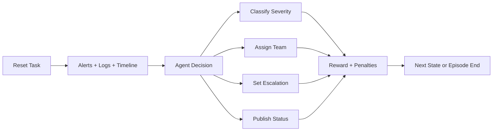
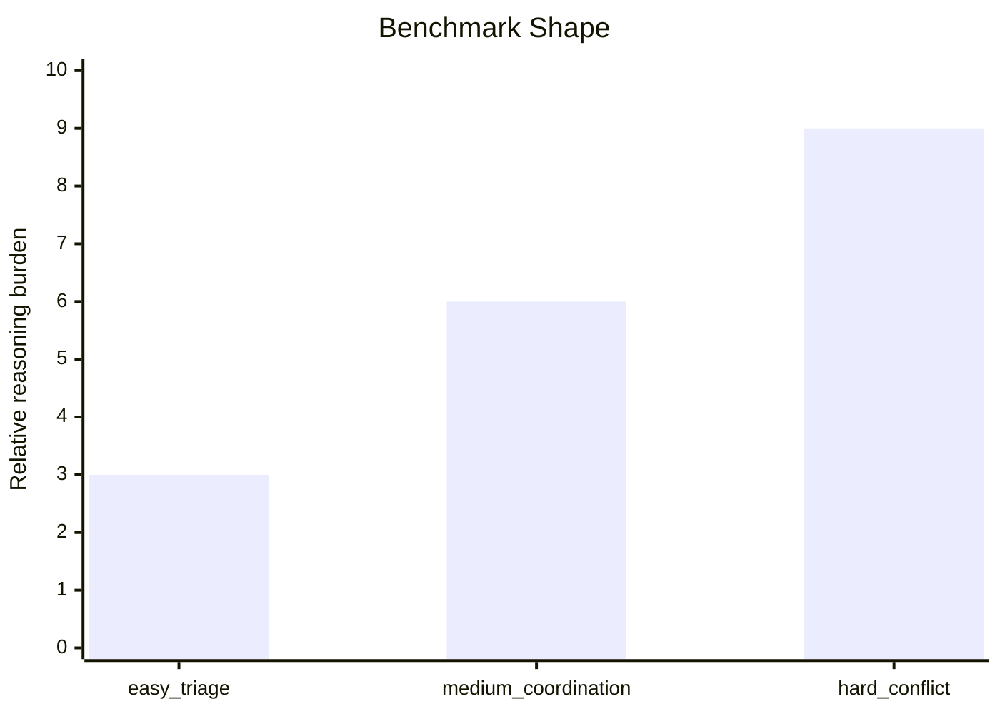

# Incident Response Commander

`incident_env` is a real-world OpenEnv benchmark for **incident command during production outages**. Instead of solving a toy problem, an agent must behave like an on-call incident commander: classify severity, assign the correct response team, decide escalation, and publish a structured status update under uncertainty.

The environment is designed for **deterministic evaluation** and **trajectory-shaped rewards** while still feeling like an actual operational workflow. Each episode exposes alerts, logs, service topology, and timeline evidence from a hidden incident scenario. The agent interacts through the standard OpenEnv loop: `reset()` → `step()` → `state()`.

## Why This Benchmark Matters

Modern agents are increasingly asked to operate in high-stakes production settings. Incident command requires:

- separating root cause from downstream symptoms
- choosing the correct organizational owner, not just naming a broken service
- deciding whether broad escalation is justified
- communicating clearly without hallucinating or overstating customer impact

This benchmark evaluates whether an agent can do all four in sequence, with deterministic scoring and explicit penalties for low-quality decisions.



## What the Agent Must Do

Each episode requires four concrete outputs:

1. `SEV-1` to `SEV-4` severity classification
2. owning team assignment:
   `backend`, `infra`, `database`, `network`, `security`, `sre`
3. escalation decision:
   `true` or `false`
4. structured communication:
   `summary`, `customer_impact`, `next_action`, `owner`

The environment currently ships with **28 deterministic scenarios**:

- `8` easy
- `8` medium
- `12` hard

The hard set includes conflicting signals, noisy infra symptoms, misleading alerts, and ambiguous ownership to reduce simple pattern matching.

## Task Design

Three benchmark tasks are exposed and used by the baseline:

| Task ID | Difficulty | What It Tests |
|---|---|---|
| `easy_triage` | Easy | obvious failures with clear ownership and severity |
| `medium_coordination` | Medium | mixed signals requiring better team/escalation reasoning |
| `hard_conflict` | Hard | conflicting evidence where the loudest alert is not the root cause |

Task selection is implemented in [incident_env/tasks/catalog.py](./incident_env/tasks/catalog.py), with scenario data in [incident_env/tasks/scenarios.py](./incident_env/tasks/scenarios.py).



## Action, Observation, and State Spaces

### Action: `IncidentAction`

The agent acts with a typed Pydantic model:

- `action_type`
- `severity` for `classify_severity`
- `team` for `assign_team`
- `escalate` for `set_escalation`
- `status_update` for `publish_status`
- optional `rationale`

### Observation: `IncidentObservation`

The agent receives:

- incident metadata: `incident_id`, `title`, `task_name`, `difficulty`
- evidence: `alerts`, `logs`, `service_map`, `timeline`
- progress flags for the four required decision dimensions
- the submitted choices so far
- `allowed_actions`
- `last_action_error`
- `reward_breakdown`
- `steps_remaining`

### State: `IncidentState`

The environment tracks:

- episode identity and counters
- submitted severity/team/escalation/status
- per-dimension reward components
- cumulative penalties
- final bounded score

## Reward Design

The environment returns shaped rewards across the trajectory while the final episode score stays strictly inside the evaluator-required range.

Positive components:

- `+0.30` correct severity
- `+0.30` correct team
- `+0.20` correct escalation
- `+0.20` accurate communication

Communication credit is split across:

- service/incident summary quality
- customer impact correctness
- mitigation direction
- owner correctness

Penalty behavior:

- wrong severity/team/escalation decisions reduce score
- repeated decisions reduce score
- low-quality or contradictory status updates reduce score
- communication is weakened when upstream triage is wrong

All exposed task scores are clamped strictly inside `(0, 1)` to satisfy the evaluation requirement.

## Baseline Inference

The required root-level [inference.py](./inference.py) uses the OpenAI client and emits strict evaluator logs:

- `[START]`
- `[STEP]`
- `[END]`

It runs all three tasks sequentially and currently produces:

| Task | Local Baseline Score |
|---|---|
| `easy_triage` | `0.99` |
| `medium_coordination` | `0.99` |
| `hard_conflict` | `0.99` |

The baseline is deterministic and evidence-driven. It no longer keys directly off exact scenario titles.

## Local Setup

```powershell
python -m venv .venv
.\.venv\Scripts\Activate.ps1
pip install --upgrade pip
pip install -e .[dev]
Copy-Item .env.example .env
```

Set at least:

```env
HF_TOKEN=your_token_here
API_BASE_URL=https://router.huggingface.co/v1
MODEL_NAME=Qwen/Qwen2.5-72B-Instruct
```

## Run Locally

Direct Python usage:

```python
from incident_env import IncidentAction, IncidentEnv, SeverityLevel

env = IncidentEnv()
obs = env.reset("easy_triage")
obs, reward, done, info = env.step(
    IncidentAction(action_type="classify_severity", severity=SeverityLevel.SEV1)
)
```

Serve the environment:

```powershell
python -m server.app
```

Or:

```powershell
server
```

Then open:

```text
http://127.0.0.1:7860/web
```

## Validation

```powershell
python -m pytest -q
.\.venv\Scripts\openenv validate
python inference.py
docker build -t incident-env .
docker run --rm -p 7860:7860 incident-env
```

## Docker and Hugging Face Spaces

The root [Dockerfile](./Dockerfile) is HF Space compatible and sets:

- Python 3.11 slim
- `ENABLE_WEB_INTERFACE=true`
- `uvicorn server.app:app --host 0.0.0.0 --port 7860`

Deploy with:

```powershell
.\.venv\Scripts\openenv push --repo-id <your-username>/incident-response-commander
```

After deployment, set Space configuration:

- Secret: `HF_TOKEN`
- Variable: `API_BASE_URL=https://router.huggingface.co/v1`
- Variable: `MODEL_NAME=Qwen/Qwen2.5-72B-Instruct`

Then verify:

- `/reset`
- `/schema`
- `/web`

## Repository Layout

```text
incident_env/
|-- client.py
|-- env.py
|-- graders.py
|-- models.py
|-- task_graders.py
|-- server/
|   |-- app.py
|   |-- incident_environment.py
|   |-- requirements.txt
|   `-- web_ui.py
`-- tasks/
    |-- catalog.py
    `-- scenarios.py
```

## What Makes This Submission Strong

- real operational workflow instead of a toy benchmark
- deterministic and programmatic grading
- trajectory-shaped rewards with penalties
- explicit easy / medium / hard progression
- Docker + Hugging Face Space deployment
- custom `/web` interface for incident playthroughs
- task/grader exposure in `openenv.yaml`

## Scope

This is intentionally an **incident command benchmark**, not a full ticketing, chatops, or live tool-use simulator. The environment is optimized for reliable evaluation under hackathon constraints: deterministic scoring, bounded runtime, and simple deployment, while still modeling a real decision loop that organizations care about.
